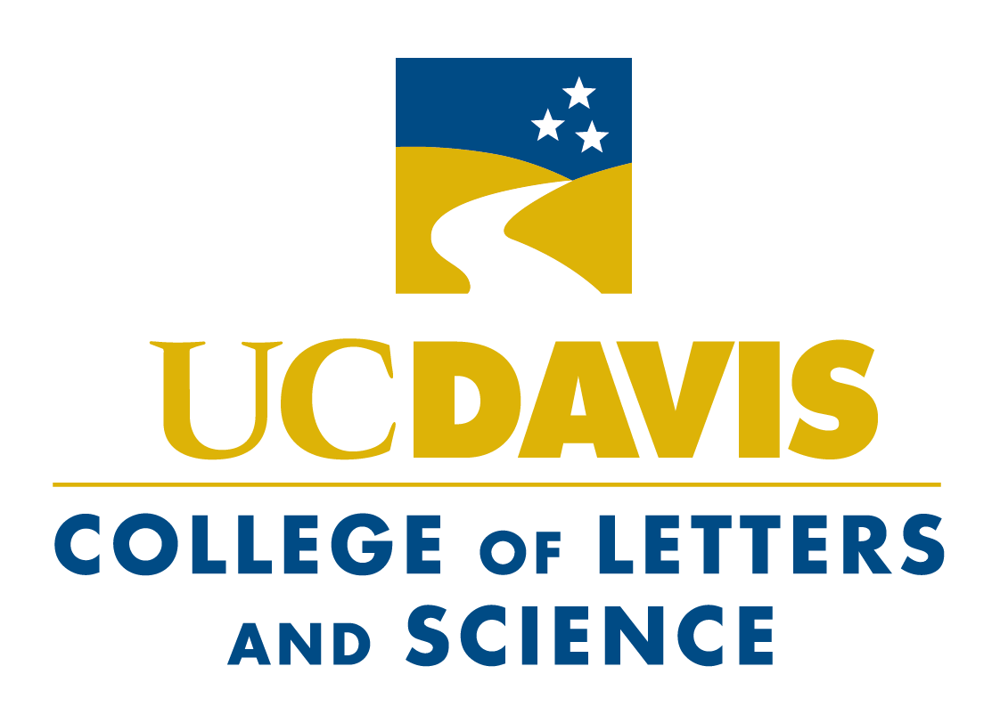
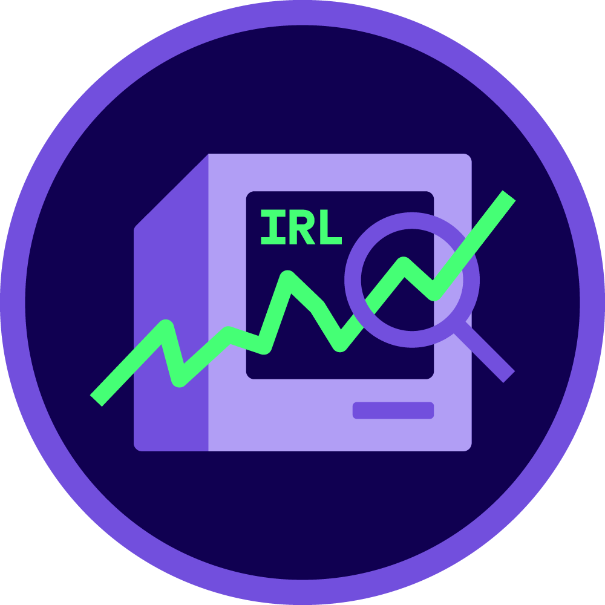

# Adding Links to Work Items

You can make any item in the "Currently" or "Previously" sections clickable by wrapping it in a link.

## How to Add a Link

### Basic Structure:

```html
<div class="item">
    <a href="YOUR-URL-HERE" target="_blank" rel="noopener noreferrer" class="item-link">
        <div class="logo-container">
            
            <div class="item-info">
                <div class="item-title">Your Position</div>
                <div class="item-org">Organization Name</div>
            </div>
        </div>
    </a>
</div>
```

## Examples:

### Link to California Aggie Website
```html
<div class="item">
    <a href="https://theaggie.org/" target="_blank" rel="noopener noreferrer" class="item-link">
        <div class="logo-container">
            
            <div class="item-info">
                <div class="item-title">Staff Writer: Opinion</div>
                <div class="item-org">The California Aggie</div>
            </div>
        </div>
    </a>
</div>
```

### Link to UC Davis Homepage
```html
<div class="item">
    <a href="https://www.ucdavis.edu/" target="_blank" rel="noopener noreferrer" class="item-link">
        <div class="logo-container">
            
            <div class="item-info">
                <div class="item-title">Statistics & STS</div>
                <div class="item-org">UC Davis</div>
            </div>
        </div>
    </a>
</div>
```

### Link to Research Lab Page
```html
<div class="item">
    <a href="https://asucd.ucdavis.edu/innovation-research-lab" target="_blank" rel="noopener noreferrer" class="item-link">
        <div class="logo-container">
            
            <div class="item-info">
                <div class="item-title">Senior Researcher</div>
                <div class="item-org">ASUCD Innovation & Research Lab</div>
            </div>
        </div>
    </a>
</div>
```

## Link Attributes Explained:

- **`href`**: The URL to link to
- **`target="_blank"`**: Opens link in new tab
- **`rel="noopener noreferrer"`**: Security best practice for external links
- **`class="item-link"`**: Applies the proper styling

## To Remove a Link:

If you want an item to NOT be clickable, just remove the `<a>` tag:

```html
<div class="item">
    <div class="logo-container">
        
        <div class="item-info">
            <div class="item-title">Your Position</div>
            <div class="item-org">Organization Name</div>
        </div>
    </div>
</div>
```

## Tips:

- Links will have the same hover effect as the item background
- Entire item becomes clickable (logo + text)
- Links open in new tabs automatically
- Works for both "Currently" and "Previously" sections
